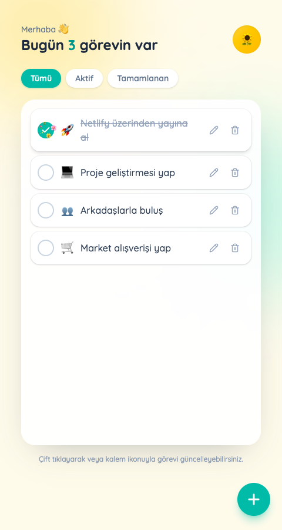

# Todo App

Basit bir yapılacaklar listesi uygulaması. React ve TypeScript ile yazdım, Tailwind CSS ile stillendirdim, veriler tarayıcının localStorage'ında tutuluyor.

**Demo:** https://todoappsenasli.netlify.app
**Repo:** https://github.com/senasliturk/to_do_app



Görev ekleyip düzenleyebiliyorsun (çift tıklayarak ya da kalem ikonuyla), silebiliyorsun, "Tümü / Aktif / Tamamlanan" filtreleriyle bakabiliyorsun. Bir görevi tamamlandı işaretleyince küçük bir çiçek animasyonu oynuyor, görev metnine göre de otomatik emoji seçiliyor (market, spor, toplantı gibi kelimeleri tanıyor).

## Teknolojiler

React 19, TypeScript, Vite, Tailwind CSS v4, ikonlar için lucide-react.

## Klasör yapısı

```
src/
├── components/   TodoForm, TodoItem, TodoList, FlowerBurst
├── pages/        HomePage
├── interfaces/   Todo tip tanımı
├── hooks/        useTodos — localStorage okuma/yazma
└── utils/        taskIcon — görev metnine göre emoji seçimi
```

## Çalıştırmak için

```bash
npm install
npm run dev
```

`http://localhost:5173` adresinden açılıyor. Build için: `npm run build`
